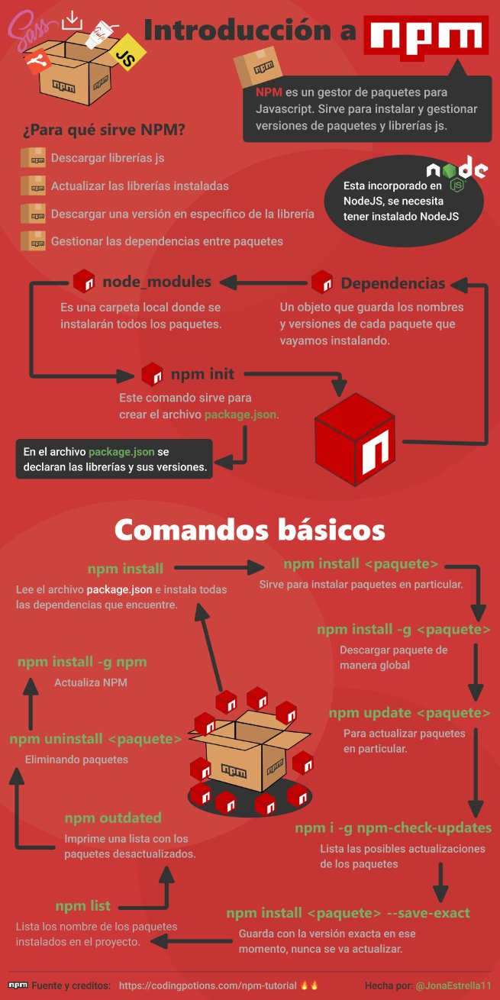

<h1 align="center">Conceptos Front End</h1>
Conceptos usados en el track de Front End.

---

## Compilar
Compilar es el proceso de transformar un programa informático escrito en un lenguaje en un programa equivalente en otro formato. Al programa que se encarga de compilar se le llama `compilador`. A veces, a esta tarea se le llama "ensamblar" o "construir", lo que suele implicar otros procesos adicionales, e.j. empaquetarlo en formato binario.

## Transpilador
Programas que traducen un lenguaje a otro del mismo nivel. Ejemplo: Al compilar de TypeScript a JavaScript. 

---

## ¿Qué licencia elegir para tu software?
A grandes rasgos existen dos tipos de licencias: las de Copyright y las Open Source(Copyleft). No elegir una licencia para nuestro proyecto no es una buena práctica.

Si no hubiera licencia alguna en tu proyecto, significaría que automáticamente se aplicarían las leyes de derechos de autor. Es decir, conservarías todos los derechos sobre el código fuente y nadie más podrá reproducir, distribuir o crear trabajos derivados de tu proyecto.

Pudiera parecer que el Copyright por defecto es la opción más cómoda y directa; sin embargo, no es así exactamente. De hecho, la ausencia de licencia es perjudicial para el ecosistema comercial del software, por la falta de control. Así, las empresas no quieren saber nada de software sin licenciar, y se pierde mucho, mucho dinero por el camino.

Sea como fuere, infórmate y licencia tu software. Y si no te importan estos temas ni lo que puedan hacer otros con tu software, para ello existe la Licencia MIT.

### Conceptos:

- Copyright: 
En español `Derechos de autor`. Esto le proporciona al responsable de un contenido artístico o de una obra intelectual un derecho de autor cada vez que sea reproducido o utilizado, participando por ley en los posibles beneficios que genere su trabajo.

- Copyleft:
Práctica legal que consiste en el ejercicio del derecho de autor con el objetivo de propiciar el libre uso y distribución de una obra, exigiendo que los concesionarios preserven las mismas libertades al distribuir sus copias y derivados.


### Recursos:
- Para poder elegir la licencia adecuada, Github nos ofrece la siguiente guía: https://choosealicense.com/.
- [Agregar una licencia a tu repositorio](https://help.github.com/es/github/building-a-strong-community/adding-a-license-to-a-repository)
- [Cómo elegir la licencia correcta para tu proyecto Open Source](https://hipertextual.com/archivo/2014/05/como-elegir-licencias-open-source/)
- [¿Sabes bien qué licencia elegir para tu software?](https://www.muylinux.com/2013/07/18/eleccion-licencia-software/)

---

## Añadiendo insignias a nuestro README

Las insignias en nuestro README podrían indicar datos como el número de descargas, el estado de la build, la cobertura de los tests, etc.

#### Ejemplos de insignias:
<p align="center">
  
  
</p>

`build`: Indica el estado de la compilación.

En nuestro ejemplo, indica que la compilación está "pasando" (comúnmente significa que las pruebas pasan y nada explotó durante la compilación más reciente).

### Recursos

- Página para crear insignias: https://shields.io/
- [Enriqueciendo el README con Shields.io](https://www.ikeinyyo.com/shields-io-enriqueciendo-nuestro-readme-md/)

---

## Testing en el desarrollo de software

 Es el proceso de comprobar que tu aplicación funciona correctamente, con el fin de obtener información acerca de su calidad.
 
 ### Tipos de pruebas
 
 #### Según la ejecución o no del código:
 
 - Estáticas: Se realizan sin necesidad de ejecutar el código. Un ejemplo de este tipo de pruebas puede ser la revisión estática de código, es decir, analizar el código fuente de una aplicación en busca de defectos, de algún tipo de patrones incorrectos y demás.
 
 - Dinámicas: Se realizan ejecutando el software para poder probarlo. Por ejemplo, pruebas funcionales.
 
 #### Según el uso de herramientas:
 
 - Manuales: Se prueba una navegación normal. Por ejemplo, acceder a la aplicación y pulsar los botones para comprobar si funciona o no.
 
- Automáticas: Se utiliza una o varias herramientas para realizar estas pruebas.

 #### Según lo que verifican:
 
 - **Pruebas funcionales:** Revisan el comportamiento del sistema, subsistema o componente software. Entre las más importantes tenemos:
 
      - Pruebas unitarias: Prueba trozos de código concretos para ver que funciona y que no tiene errores.
      - Pruebas de integración: Prueba a todos los componentes juntos, para ver cómo interactúan entre ellos y comprobar que todo vaya bien.
      - Pruebas de aceptación: Las realiza el usuario. Puede que un software no contenga errores, que funcione bien, pero tal vez no hace lo que debería hacer, no está haciendo lo que el usuario quería que hiciese.
      - Pruebas de regresión: Verifican un conjunto de escenarios que funcionaron correctamente en el pasado, para asegurar que continúen así. Una falla en una prueba de regresión significa que una nueva funcionalidad ha afectado otra funcionalidad que era correcta en el pasado, causando una "regresión".
    
- **Pruebas no funcionales:** Consideran el comportamiento externo del sistema. Hay varios tipos:

     - Pruebas de seguridad: Buscan vulnerabilidades de seguridad (hacking ético).
     - Pruebas de rendimiento: Permiten conocer el comportamiento del software ante una carga determinada, cómo responde y cómo se recupera ante fallos.
     - Pruebas de usabilidad: Permiten saber el nivel de usabilidad de la aplicación, pero sin entrar en aspectos funcionales. Por ejemplo, si tiene un menú que hace que la navegación sea intuitiva, si tiene un contenido de ayuda que explica el funcionamiento de la aplicación, etc.
     - Pruebas de accesibilidad: Tienen por fin determinar la facilidad con la que se puede utilizar un sitio web. Por ejemplo, correcta visualización de los elementos, proveer alternativas de uso para personas con alguna discapacidad visual o auditiva, etc.
      
Tal vez hayas oído de las pruebas de caja blanca y de caja negra, pero lo que ocurre con las mismas es que no son tipos de pruebas, sino técnicas de pruebas de software.

### Cuando NO testear

Existe la posibilidad de que desarrollar pruebas automáticas haga más lenta tu experiencia de desarrollo. Recordemos que el propósito de las pruebas automáticas es ahorrar tiempo.

### En resumen

   - No siempre hace falta tener pruebas automáticas 🤔
   - No necesitas tests si pasas más tiempo re-escribiendo tests que desarrollando funcionalidades.
   - Tu objetivo no es obtener el 💯% de cobertura en tus tests 🚫. 
   - No eres mejor tester por tener todo al 💯%.
   - TDD es bueno. TDD estricto y a rajatabla puede ser un dolor de cabeza.

 ### Recursos

 - [Tipos de testing en el desarrollo de software](https://programacionymas.com/blog/tipos-de-testing-en-desarrollo-de-software)
 
 ---
 
 ## Metodologías de Desarrollo (DD's)
 
 ### TDD (Test Driven Development)
Práctica de programación que consiste en escribir primero las pruebas (generalmente unitarias), después escribir el código fuente que pase la prueba satisfactoriamente y, por último, refactorizar el código escrito. 

Funciona apropiadamente siempre que la dirección de la organización esté familiarizada con estas pruebas unitarias, en definitiva sus habilidades técnicas deberán ser lo suficientemente sólidas. Entre sus beneficios podemos obtener un código más robusto, seguro, mantenible y una mayor rapidez en el desarrollo.
 
 ### BDD (Behauvior Driven Development)
Desarrollo dirigido por comportamiento. Las pruebas se deben definir antes del desarrollo, éstas se centran en el usuario y el comportamiento del sistema. El principal objetivo es que el equipo describa los detalles de cómo se debe comportar la aplicación a desarrollar, y de esta forma será comprensible por todos.

BDD tiene la ventaja de que las pruebas unitarias se pueden escribir en un lenguaje común utilizado por todas las partes interesadas. 

### Recursos

- [TDD como metodología de diseño de software](https://www.paradigmadigital.com/dev/tdd-como-metodologia-de-diseno-de-software/)
- [¿Qué es BDD (Behavior Driven Development)?](https://www.itdo.com/blog/que-es-bdd-behavior-driven-development/)

---

## CLI (Interfaz de línea de comandos)
Es un método que permite a los usuarios dar instrucciones a algún programa informático por medio de una línea de texto simple. Debe notarse que los conceptos de CLI, shell y emulador de terminal no son lo mismo ya que CLI es un método mientras que shell y emulador de terminal son programas informáticos. Sin embargo los tres suelen utilizarse como sinónimos.

Las CLI pueden emplearse interactivamente, escribiendo instrucciones en alguna especie de entrada de texto, o pueden utilizarse de una forma mucho más automatizada (archivo batch), leyendo órdenes desde un archivo de scripts. 

---

## Nodejs

Es un entorno de tiempo de ejecución de JavaScript de lado del servidor que utiliza un modelo asíncrono y es dirigido por eventos. Dentro de Node, el código se organiza por módulos o paquetes, así que al momento de trabajar con él va a ser necesario agregar más módulos, es aquí donde entra npm.

### Instalar nodejs desde la terminal de Linux:

```
sudo apt-get install nodejs
```

Para verificar la instalación de NodeJs ingrese el siguiente comando:

```
nodejs -v
```

### Recursos

- [¿Qué es NodeJs?](https://openwebinars.net/blog/que-es-nodejs/)

---

## NPM (Node Package Manager)

Es un gestor de paquetes desarrollado en su totalidad bajo el lenguaje JavaScript. Sirve para instalar y gestionar versiones de paquetes y librerías js.

`npm` se incluye con Node.js , por lo que si instala Node.js automáticamente también tendrá `npm` instalado. 

Para verificar la instalación de `npm` ingrese el siguiente comando:

```
npm -v
```

En caso no haya ocurrido la instalación. Pruebe ejecutando el siguiente comando:

```
sudo apt-get install npm
```

Al instalar paquetes nuevos estos serán almacenados localmente en la carpeta que lleva por nombre `node_modules` dentro de nuestro proyecto (esto se lleva a cabo por defecto) sin embargo el desarrollador puede indicarle a `npm` que instale dicho paquete de forma global, según lo considere necesario.

<br><p align="center"></p>

### Recursos

- [Tutorial NPM](https://codingpotions.com/npm-tutorial)

---

## API (Application Programming Interface)

Es un conjunto de definiciones y protocolos que se utiliza para desarrollar e integrar el software de las aplicaciones. API significa interfaz de programación de aplicaciones.

Las API permiten que sus productos y servicios se comuniquen con otros, sin necesidad de saber cómo están implementados. Esto simplifica el desarrollo de las aplicaciones y permite ahorrar tiempo y dinero. Las API le otorgan flexibilidad; simplifican el diseño, la administración y el uso de las aplicaciones, y proporcionan oportunidades de innovación, lo cual es ideal al momento de diseñar herramientas y productos nuevos (o de gestionar los actuales).

### Tipos de APIs 

● **APIs de servicios web:** 
Son las interfaces de desarrollo de aplicaciones que permiten el intercambio de información entre un servicio web (software que da acceso a un servicio concreto a través de una URL) y una aplicación. 

Normalmente ese intercambio se produce a través de peticiones HTTP o HTTPS (la versión cifrada del protocolo HTTP). La información será transportada en un formato `XML` o `JSON`.

Hay cuatro tipos de API de servicios web:

- SOAP (Simple Object Access Protocol): Protocolo estándar de intercambio de información y datos en XML entre dos objetos.
- XML-RPC: Protocolo de llamada a procedimiento remoto que usa XML como formato de datos y llamadas HTTP como sistema de comunicación.
- JSON-RPC: Mismo protocolo que el anterior pero en formato JSON.
- REST (Representational State Transfer): Arquitectura de software para sistemas hipermedia en la World Wide Web; una API REST usa el protocolo HTTP.

● **APIs basadas en bibliotecas:** Permiten que una aplicación importe una biblioteca de otro software para hacer el intercambio de información. Gran parte de las bibliotecas que dan acceso a productos y servicios están diseñadas en JavaScript. Ejemplo: la API de Google Maps.

● **APIs basadas en clases:** Permite hacer uso de clases ya definidas, éstas poseen lógica de programación. De esta forma, permiten agilizar nuestro proceso de desarrollo de software. Ejemplo: API de Java.

● **APIs de funciones en sistemas operativos:** Permiten que los programas de software interactuen con el sistema operativo. De tal forma, podemos tener acceso a elementos como el teclado, mouse, interfaz gráfica, podemos crear procesos, hilos, etc.

---

## REST (Representational State Transfer)

Es un modelo de arquitectura de software basado en el protocolo HTTP. Consiste en una serie de directrices que mejora las comunicaciones cliente-servidor.

### Rest sigue una serie de principios:

- Todo lo que se mueve a través de las comunicaciones web son recursos, es decir, los datos se representan con el formato específico que tienen y no como un archivo físico.
- Cada uno de estos recursos ha de tener un identificador único, por ello poseen una URI única que los identifican de los demás.
- Este protocolo de transmisión de datos debe utilizar los verbos estándares de HTTP, definidos en el protocolo nativo, donde cada uno de estos verbos significa una acción diferente. Hay 8 acciones principales ya definidas: GET, POST, PUT, DELETE, HEAD, OPTIONS, TRACE, CONNECT.
- Cada recurso puede tener múltiples representaciones, independientemente de cómo esté almacenado. Un ejemplo sería un recurso en formato XML y poder solicitarlo en JSON.
- Comunicaciones cliente-servidor, se trata de comunicaciones que se denominan sin estado (STATELESS), lo que significa que cada petición al servidor es tratada de manera totalmente independiente.

### Ventajas de Rest

- **Separación de un recurso de su representación:** Rest puede tener múltiples representaciones. No tiene estado, por lo tanto, hay que especificar en el encabezado de la petición HTTP el tipo de contenido que se desea obtener. Tras este paso, será la aplicación del servidor la encargada de manejar la representación y devolver el estado HTTP apropiado, al cual finalmente deberíamos enviarle al servidor qué es lo que esperamos recibir.

- **Visibilidad:** Rest está diseñado para ser visible y simple, lo que significa que cada aspecto del servicio debe ser autodescriptivo siguiendo las normas HTTP.

- **Seguridad:** Al utilizar Rest garantizamos que los métodos HTTP son seguros, lo que significa que, al solicitar un recurso, este requerimiento no modifica o causa ningún tipo de cambio en su estado.

- **Escalabilidad:** Si el aumento de la demanda exige aumentar el número de servidores, esto puede hacerse sin preocuparse por la sincronización entre los mismos, puesto que no hay que estar pendiente del estado de los recursos.

- **Rendimiento:** La escalabilidad no debe ser confundida con el rendimiento. El rendimiento se mide por el tiempo necesario para que una única petición sea procesada, mientras que la escalabilidad depende del número total de peticiones que la aplicación puede manejar.

### Recursos:
- [API REST](https://bbvaopen4u.com/es/actualidad/api-rest-que-es-y-cuales-son-sus-ventajas-en-el-desarrollo-de-proyectos)
- [¿Qué es REST y RESTful?](https://www.youtube.com/watch?v=pVAMOielOJQ)
- [Rest vs Restful](https://www.muycomputerpro.com/zona-ticjob/competencia-ticjob-rest-vs-restful/)

---

## RESTful
Son los servicios web que implementan la arquitectura Rest.

---

## Preprocesador de CSS

Es un lenguaje de hoja de estilos que nos permite escribir pseudo-código `CSS` que luego será convertido a `CSS` real. Ese pseudo-código se conforma de variables, condiciones, bucles o funciones.

El objetivo de estos preprocesadores es tener un código más sencillo de mantener y editar. Los preprocesadores incluyen características tales como variables, funciones, mixins, anidación o modularidad. 

**Ejemplos:** Sass, Less, Stylus, etc.

---

## Patrones de arquitectura de software

Es un conjunto de patrones y abstracciones coherentes que proporcionan un marco definido y claro para interactuar con el código fuente del software.

### MVC (Model - View - Controller)

También llamado Modelo - Vista - Controlador. Se utiliza para implementar sistemas donde se requiere el uso de interfaces de usuario. Crea software más robusto con un ciclo de vida más adecuado, donde se potencia la facilidad de mantenimiento, reutilización del código y la separación de conceptos. 

Se fundamenta en la separación del código en tres capas diferentes:

- **Modelo:** Es la capa donde se trabaja con los datos, por tanto contendrá mecanismos para acceder a la información y también para actualizar su estado. Los datos los tendremos habitualmente en una base de datos, por lo que en esta capa tendremos todas las funciones que accederán a las tablas y harán los correspondientes selects, updates, inserts, etc. 
- **Vista:** Contiene el código de las interfaces de usuario.
- **Controlador:** Es la capa que sirve de enlace entre las `vistas` y el `modelo`, respondiendo a los mecanismos que puedan requerirse para implementar las necesidades de nuestra aplicación. Por lo tanto, contiene el código que responde a las acciones que se solicitan en la aplicación, como visualizar un elemento, realizar una compra, una búsqueda de información, etc. Su responsabilidad no es manipular directamente datos, ni mostrar ningún tipo de salida.

#### Usos

- Arquitectura para aplicaciones World Wide Web en los principales lenguajes de programación.
- Marcos web como Django y Rails.

### Patrón de capas

Se utiliza para estructurar programas que se pueden descomponer en grupos de sub-tareas y cada una de ellas se encuentra en un nivel particular de abstracción. Cada capa proporciona servicios a la siguiente capa superior.

Las 4 capas más comunes encontradas en un sistema de información general son las siguientes:

- Capa de presentación (también conocida como capa UI)
- Capa de aplicación (también conocida como capa de servicio)
- Capa de lógica de negocios (también conocida como capa de dominio)
- Capa de acceso a datos (también conocida como capa de persistencia)

#### Usos

- Aplicaciones de escritorio generales.
- Aplicaciones web de comercio electrónico.

### Recursos

- [Los 10 patrones comunes de arquitectura de software](https://medium.com/@maniakhitoccori/los-10-patrones-comunes-de-arquitectura-de-software-d8b9047edf0b)
- [¿Qué es el patrón Modelo-Vista-Controlador?](https://www.youtube.com/watch?v=ANQDmqBYwns&t=906s)

---

## Plugin o complemento:

Es una aplicación que se relaciona con otra para agregarle una función nueva y generalmente muy específica. 
